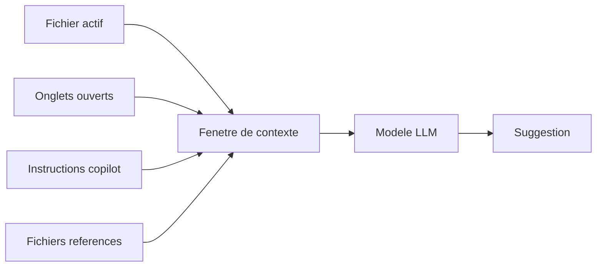

# GitHub Copilot in Practice

## Jour 1 — Comprendre Copilot et pourquoi la configuration compte

<br>

**Accenture Technology**

<!--
Bienvenue dans cette formation de 6 jours dediee a GitHub Copilot.
Aujourd'hui, nous posons les fondations avant de toucher a un fichier de configuration.
-->

---
layout: section
---

# Programme du jour

---

# Ce que nous allons couvrir

<v-clicks>

1. **Qu'est-ce que GitHub Copilot ?** — Bien plus qu'un auto-completeur
2. **L'interface Copilot dans VS Code** — Tour complet de l'outil graphique
3. **Les modes d'interaction** — Inline, Chat, Agent, Edits
4. **Les Chat Participants** — `@workspace`, `@vscode`, `@terminal`
5. **Selection de modeles** — Rapide vs. Raisonnement
6. **Les 5 primitives de personnalisation** — La feuille de route des 6 jours
7. **Demo avant/apres** — L'impact de la configuration sur les suggestions

</v-clicks>

<!--
Chaque point sera approfondi. Ce module est 100% theorie — les labs commencent demain.
-->

---
layout: section
---

# Qu'est-ce que GitHub Copilot ?

---

# Copilot : le modele mental

> Copilot est un **nouveau membre talentueux de l'equipe** — il ecrit du bon code mais ne connait **rien** de votre codebase, vos conventions, ou votre architecture.

<br>

<v-clicks>

- Chaque suggestion est basee **uniquement** sur ce qui est dans la **fenetre de contexte** au moment de la requete
- Sans configuration → suggestions **generiques** (comme un developpeur freelance le jour 1)
- Avec configuration → suggestions **alignees** avec votre projet (comme un collegue qui connait les regles)

</v-clicks>

<!--
C'est LA metaphore cle de toute la formation. Gardez-la en tete.
Copilot ne "comprend" pas votre projet — il lit ce qu'on lui donne.
-->

---

# Ce que Copilot sait... et ne sait pas

| Sans configuration | Avec configuration |
|---|---|
| Utilise des patterns generiques | Respecte VOS conventions |
| Propose n'importe quel framework | Utilise VOS libraries preferees |
| Nomme les variables comme il veut | Suit VOS regles de nommage |
| Ignore votre architecture | Respecte VOS couches (Controller → Service → Repository) |
| Genere des tests basiques | Suit VOS patterns de test (AAA, naming, framework) |

<br>

<v-click>

**La personnalisation est la facon dont vous partagez ce contexte de maniere fiable et coherente.**

</v-click>

---

# Comment Copilot assemble le contexte



<v-clicks>

- **Fichier actif** — Le code que vous editez en ce moment
- **Onglets ouverts** — Les fichiers ouverts dans VS Code
- **Instructions** — `copilot-instructions.md` + fichiers file-based
- **Fichiers references** — Fichiers mentionnes via `#file` ou `@workspace`

</v-clicks>

<!--
Le contexte est TOUT. Si Copilot ne voit pas l'information, il ne peut pas l'utiliser.
C'est pourquoi la configuration est si importante.
-->

---
layout: section
---

# L'interface Copilot dans VS Code

---

# Tour de l'interface — Vue d'ensemble

Les 4 points d'acces a Copilot dans VS Code :

<v-clicks>

1. **Suggestions inline** (ghost text) — apparaissent pendant que vous tapez
2. **Copilot Chat** (panneau lateral) — `Ctrl+Alt+I` conversation interactive
3. **Copilot Plan** — planification avant execution, validation etape par etape
4. **Quick Chat** — `Ctrl+Shift+I` mini-fenetre rapide

</v-clicks>

<br>

<v-click>

> Les suggestions inline n'utilisent **PAS** les instructions custom.
> Seul le **Chat** (et ses variantes) beneficie de la configuration.

</v-click>

---

# Suggestions inline (Ghost Text)

**Comment ca marche :**
- Copilot analyse le code autour du curseur
- Propose une completion en texte gris
- `Tab` pour accepter, `Esc` pour rejeter

<br>

**Limites :**
- Contexte restreint (fichier courant + onglets)
- Pas d'acces aux instructions custom
- Pas de conversation possible

<br>

**Quand l'utiliser :** Completions rapides, boilerplate, patterns repetitifs

---

# Copilot Chat — Le panneau lateral

**Raccourci :** `Ctrl+Alt+I`

Le Chat est le mode le plus puissant :

<v-clicks>

- Conversation complete avec contexte enrichi
- Lit les **instructions custom** (`copilot-instructions.md`)
- Supporte les **Chat Participants** (`@workspace`, `@vscode`, `@terminal`)
- Supporte les **commandes slash** (`/review-code`, `/generate-tests`)
- Supporte le **drag & drop** de fichiers comme contexte

</v-clicks>

---

# Les 3 modes du Chat

| Mode | Icone | Ce qu'il fait | Quand l'utiliser |
|------|-------|---------------|------------------|
| **Ask** | 💬 | Repond sans modifier de fichiers | Questions, explications, revues |
| **Agent** | 🤖 | Cree/modifie des fichiers, execute des commandes | Generation de code, refactoring |
| **Plan** | 🗺️ | Genere un plan etape par etape avant d'agir | Taches complexes, validation avant execution |

<br>

<v-click>

> **Regie cle :** Utilisez **Ask** pour comprendre, **Agent** pour agir, **Plan** pour valider avant de transformer.

</v-click>

---
layout: section
---

# Les modes d'interaction en detail

---

# Mode Ask — Comprendre sans risque

```
💬 Mode Ask — Lecture seule
```

**Exemples d'utilisation :**
- "Explique ce que fait cette methode"
- "Quels sont les problemes de securite dans ce fichier ?"
- "Quelle est l'architecture de ce projet ?"

<br>

**Avantage :** Aucun fichier n'est modifie — ideal pour la revue et l'apprentissage

---

# Mode Agent — Copilot agit pour vous

```
🤖 Mode Agent — Lecture + Ecriture + Execution
```

**Exemples d'utilisation :**
- "Ajoute un endpoint POST pour creer un employe"
- "Genere les tests unitaires pour EmployeeService"
- "Corrige les erreurs de compilation"

<br>

**L'agent peut :**

<v-clicks>

- Lire des fichiers du projet
- Creer et modifier des fichiers
- Executer des commandes dans le terminal
- Enchainer plusieurs actions automatiquement

</v-clicks>

---

# Mode Plan — Valider avant d'executer

```
🗺️ Mode Plan — Planification + Validation
```

**Comment ca marche :**
- Copilot propose un **plan structure** etape par etape
- Vous **validez ou modifiez** le plan avant tout changement
- L'execution ne commence qu'apres votre approbation

<br>

**Exemples d'utilisation :**
- "Refactorise le module d'authentification en suivant Clean Architecture"
- "Migre cette classe vers Java 21 Records"
- "Ajoute la gestion d'erreurs sur tous les endpoints"

<br>

**Difference avec Agent :** Plan presente le **raisonnement complet** avant d'agir — ideal pour les taches a fort impact

---
layout: section
---

# Les Chat Participants

---

# Chat Participants — Enrichir le contexte

Les **Chat Participants** sont des prefixes qui donnent a Copilot un contexte specialise :

| Participant | Ce qu'il fait | Exemple |
|-------------|---------------|---------|
| `@workspace` | Cherche dans tout le projet | "Comment fonctionne l'authentification ?" |
| `@vscode` | Connait les commandes VS Code | "Comment changer le theme ?" |
| `@terminal` | Lit le contenu du terminal | "Explique cette erreur de build" |

---

# @workspace — Le plus utile

```
@workspace Comment est structuree l'architecture de ce projet ?
```

<v-clicks>

- Copilot **indexe** l'ensemble du workspace
- Cherche les fichiers pertinents **automatiquement**
- Peut lire des fichiers que vous n'avez **pas ouverts**
- Ideal pour les questions d'architecture et de navigation

</v-clicks>

<br>

<v-click>

> **Astuce :** Combinez `@workspace` avec vos instructions custom pour des reponses qui respectent votre architecture.

</v-click>

---

# @terminal et @vscode

**@terminal** — Quand vous avez une erreur dans le terminal :
```
@terminal Pourquoi le build Maven echoue ?
```
Copilot lit la sortie du terminal et diagnostique le probleme.

<br>

**@vscode** — Pour les questions sur l'editeur :
```
@vscode Comment configurer le formatage automatique a la sauvegarde ?
```
Copilot connait les settings et commandes VS Code.

---
layout: section
---

# Selection de modeles

---

# Choisir le bon modele

GitHub Copilot donne acces a **plusieurs modeles** avec des forces differentes :

| Type | Modele | Force | Utilisation |
|------|--------|-------|-------------|
| **Rapide** | GPT-4o | Vitesse, completions courtes | Inline, questions simples |
| **Raisonnement** | o3-mini / Claude Sonnet | Analyse profonde, architecture | Revue de code, refactoring complexe |
| **Premium** | o1 / Claude Opus | Raisonnement avance | Decisions d'architecture, bugs complexes |

<br>

<v-click>

> **Regie :** Modele rapide pour les taches simples, modele de raisonnement pour les decisions d'architecture.

</v-click>

---

# Comment changer de modele

Dans Copilot Chat, cliquez sur le **selecteur de modele** en bas de la fenetre de chat.

<v-clicks>

- Le modele selectionne s'applique a **la session en cours**
- Vous pouvez changer de modele **en cours de conversation**
- Certains modeles consomment plus de **quota** (modeles premium)

</v-clicks>

---
layout: section
---

# Les 5 primitives de personnalisation

| # | Primitive | Ce qu'elle fait | Activation |
|---|-----------|-----------------|------------|
| 1 | **Always-On Instructions** | Standards et architecture du projet | Automatique (chaque requete) |
| 2 | **File-Based Instructions** | Regles specifiques par type de fichier | Automatique (selon `applyTo`) |
| 3 | **Prompt Files** | Commandes slash reutilisables | Manuelle (`/commande`) |
| 4 | **Skills** | Workflows multi-etapes avec scripts | Automatique (par intention) |
| 5 | **Custom Agents** | Personas IA specialisees | Manuelle (selecteur d'agent) |

---

# Primitive 1 — Always-On Instructions

```
.github/copilot-instructions.md
```

<v-clicks>

- Charge **automatiquement** a chaque requete Chat
- Decrit votre architecture, stack technique, conventions
- Un seul fichier pour tout le projet
- **Jour 2** — vous le construirez de zero

</v-clicks>

---

# Primitive 2 — File-Based Instructions

```
.github/instructions/tests.instructions.md
```

```yaml
---
applyTo: "**/test/**"
---
```

<v-clicks>

- S'active **uniquement** quand le fichier ouvert correspond au pattern
- Ajoute des regles specifiques (tests, controllers, migrations...)
- Se superpose aux instructions always-on
- **Jour 2** — vous en creerez pour vos couches applicatives

</v-clicks>

---

# Primitive 3 — Prompt Files

```
.github/prompts/review-code.prompt.md
```

<v-clicks>

- Commande slash reutilisable : `/review-code`
- Encode une tache complete avec contexte, contraintes et format de sortie
- Parametrisable avec `${input:variable}`
- **Jour 3** — vous creerez `/review-code` et `/generate-tests`

</v-clicks>

---

# Primitive 4 — Skills

```
.github/skills/run-and-fix-tests/SKILL.md
```

<v-clicks>

- S'active **automatiquement** quand l'intention correspond
- Execute des scripts, produit des sorties structurees
- Standard ouvert : [agentskills.io](https://agentskills.io)
- **Jour 4** — vous construirez un skill test-runner complet

</v-clicks>

---

# Primitive 5 — Custom Agents

```
.github/agents/refactoring-expert.agent.md
```

<v-clicks>

- Persona IA avec son propre system prompt et outils
- Maintient son identite sur toute une session
- Peut deleguer a d'autres agents (orchestration)
- **Jour 5** — vous creerez un agent de refactoring

</v-clicks>

---
layout: section
---

# Demo : avant / apres

---

# Sans configuration

```
Prompt: "Ajoute une methode findByEmail au service"
```

<v-click>

**Resultat :** Copilot genere du code generique
- Utilise `RuntimeException` au lieu de `EmployeeNotFoundException`
- Retourne l'entite directement (pas de DTO)
- Utilise `@Autowired` sur un champ (interdit dans le projet)
- Pas de logging

</v-click>

<v-click>

> **Verdict :** Le code compile, mais viole 4 regles du projet.

</v-click>

---

# Avec configuration

```
Meme prompt, meme projet — mais avec copilot-instructions.md
```

<v-click>

**Resultat :** Copilot genere du code aligne
- Utilise `EmployeeNotFoundException` → HTTP 404
- Retourne `EmployeeResponse` via MapStruct
- Injection par constructeur (`@RequiredArgsConstructor`)
- Logging avec `@Slf4j` au bon niveau

</v-click>

<v-click>

> **Verdict :** Le code compile ET respecte toutes les conventions. Zero correction manuelle.

</v-click>

---

# L'impact mesurable

| Metrique | Sans config | Avec config |
|----------|-------------|-------------|
| Suggestions acceptees sans modification | ~30% | ~85% |
| Violations d'architecture | Frequentes | Rares |
| Temps de correction post-suggestion | Eleve | Minimal |
| Coherence entre developpeurs | Variable | Uniforme |

<br>

<v-click>

**Conclusion :** La configuration transforme Copilot d'un outil generique en un assistant qui connait votre projet.

</v-click>

---
layout: section
---

# Framework d'evaluation de la qualite

---

# Comment evaluer une suggestion Copilot

A chaque suggestion, posez ces 5 questions :

<v-clicks>

1. **Architecture** — La suggestion respecte-t-elle les couches declarees ?
2. **Conventions** — Utilise-t-elle les conventions de nommage du projet ?
3. **Securite** — Introduit-elle des patterns dangereux (magic strings, secrets exposes) ?
4. **Idiomatique** — Est-elle idiomatique pour le langage et framework utilises ?
5. **Correction manuelle** — Combien de modifications manuelles faut-il apres acceptation ?

</v-clicks>

<br>

<v-click>

> Ce framework sera utilise dans **tous les modules** pour evaluer vos configurations.

</v-click>

---
layout: section
---

# Recapitulatif

---

# Ce que vous savez maintenant

<v-clicks>

- Copilot genere des suggestions basees sur le **contexte disponible**
- La **personnalisation** est la cle pour des suggestions alignees
- **4 modes d'interaction** : Inline, Chat (Ask/Agent), Edits
- **3 Chat Participants** : `@workspace`, `@vscode`, `@terminal`
- **5 primitives** de personnalisation (Instructions → Agents)
- Un **framework d'evaluation** pour mesurer la qualite

</v-clicks>

---

# Demain — Jour 2

## Custom Instructions : regles Always-On et File-Based

<v-clicks>

- Creer votre premier `copilot-instructions.md`
- Utiliser `/init` pour bootstrapper la configuration
- Creer des instructions file-based avec `applyTo`
- Verifier que Copilot applique vos regles en direct

</v-clicks>

<br>

<v-click>

**Premier lab pratique demain !**

</v-click>

---
layout: center
---

# Questions ?
