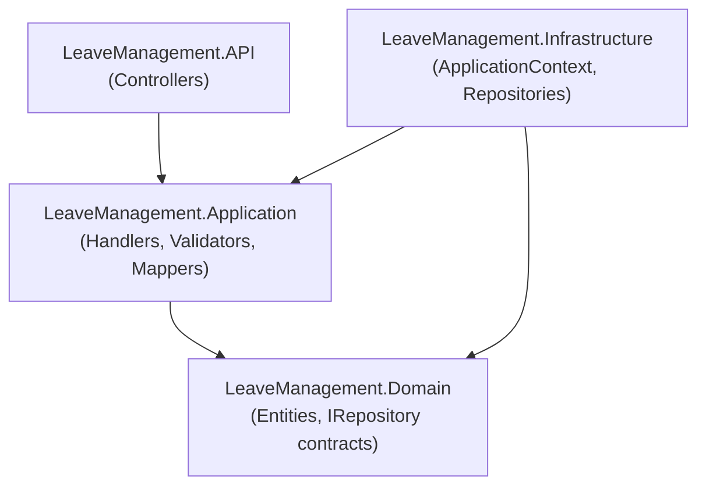

Explain the Leave Management API architecture for this scope: **${input:scope:full architecture|CQRS flow|EF Core model|dependency graph}**

## Full Architecture
If scope is **full architecture**, describe:
1. The four projects and their responsibilities (`LeaveManagement.API`, `.Application`, `.Domain`, `.Infrastructure`)
2. The allowed and forbidden dependency directions (use the table from `.github/copilot-instructions.md`)
3. Key design patterns: CQRS/MediatR, Repository, soft deletes, audit timestamps
4. How a new feature is added end-to-end (what files to create, in which project)

Produce a Mermaid diagram:

## CQRS Flow
If scope is **CQRS flow**, trace a request from HTTP call to database and back:
1. Controller receives HTTP request → creates Command/Query → calls `_mediator.Send()`
2. MediatR resolves `IRequestHandler<TRequest, TResponse>`
3. Handler validates via `IValidator<T>.ValidateAsync()`
4. On success: calls `IRepository` method → EF Core → PostgreSQL
5. `ApplicationContext.SaveChangesAsync()` intercept sets `CreatedAt`/`UpdatedAt`
6. Handler returns `BaseResponse` → controller serialises to HTTP response

Use a concrete example: `CreateEmployeeCommand` through `CreateEmployeeHandler` → `IEmployeeRepository.CreateAsync()`.

Produce a Mermaid sequence diagram.

## EF Core Model
If scope is **EF Core model**, describe:
1. The `Employee` and `Leave` entities — their properties and the relationship between them
2. Soft-delete pattern: `DeletedAt` timestamp, `BaseRepository.GetAllAsync()` filter
3. Audit timestamps: `CreatedAt`, `UpdatedAt` auto-set in `ApplicationContext`
4. Current schema strategy: `Database.EnsureCreatedAsync()` (dev) — and what changes for production migrations

Produce a Mermaid ER diagram.

## Dependency Graph
If scope is **dependency graph**, show which NuGet packages each project references and why:
- Which project owns MediatR registrations?
- Which project owns FluentValidation registrations?
- Which project owns Npgsql / EF Core?
- How are these wired in `ApplicationServiceRegistration.cs` and `InfrastructureServicesRegistration.cs`?
