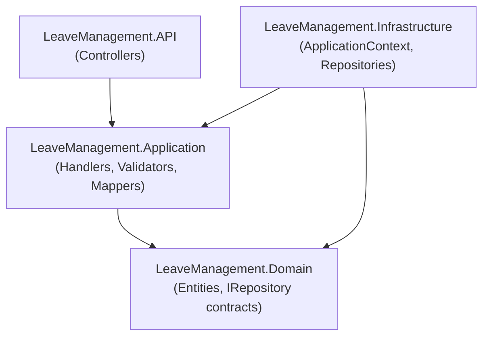
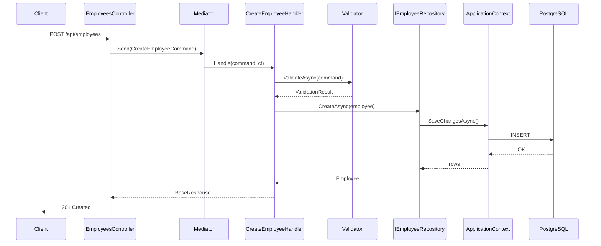
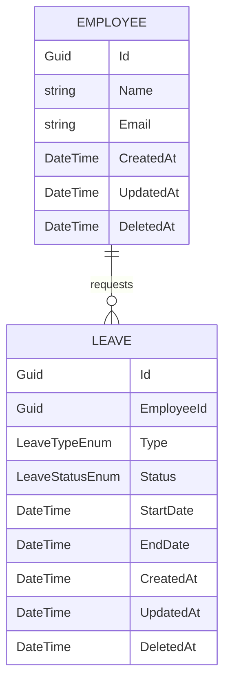
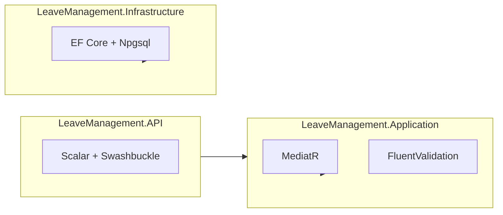

Explain the Leave Management API architecture for this scope: **${input:scope:full|cqrs|efcore|deps}**

Scope tokens map to sections:
- `full`   → Full Architecture
- `cqrs`   → CQRS Flow
- `efcore` → EF Core Model
- `deps`   → Dependency Graph

Produce ONLY the section matching the selected scope. Do not emit the other sections.
Use `.github/copilot-instructions.md` as the source of truth for layering rules and conventions.

**Diagram rendering rule (applies to every section below):**
Render ALL diagrams as ASCII art inside a fenced ```text``` code block.
Do NOT use Mermaid, PlantUML, or any other graphical DSL. Use only characters
such as `+`, `-`, `|`, `/`, `\`, `>`, `<`, `*`, and box-drawing via ASCII.

## Full Architecture (`full`)
Describe:
1. The four projects and their responsibilities (`LeaveManagement.API`, `LeaveManagement.Application`, `LeaveManagement.Domain`, `LeaveManagement.Infrastructure`)
2. The allowed and forbidden dependency directions (reuse the table from `.github/copilot-instructions.md`)
3. Key design patterns: CQRS/MediatR, Repository, soft deletes, audit timestamps
4. How a new feature is added end-to-end (what files to create, in which project)

Produce an ASCII dependency diagram based on this skeleton (adapt as needed):

```text
          +----------------------------------+
          |       LeaveManagement.API        |
          |           (Controllers)          |
          +----------------+-----------------+
                           |
                           v
          +----------------------------------+
          |    LeaveManagement.Application   |
          |  (Handlers, Validators, Mappers) |
          +----------------+-----------------+
                           |
                           v
          +----------------------------------+
          |      LeaveManagement.Domain      |
          | (Entities, IRepository contracts)|
          +----------------+-----------------+
                           ^
                           |
          +----------------+-----------------+
          |  LeaveManagement.Infrastructure  |
          |  (ApplicationContext, Repos)     |
          +----------------------------------+
                 |                ^
                 |                |
                 +--> Application-+  (Infrastructure -> Application OK)
```

## CQRS Flow (`cqrs`)
Trace a request from HTTP call to database and back:
1. Controller receives HTTP request → creates Command/Query → calls `_mediator.Send()`
2. MediatR resolves `IRequestHandler<TRequest, TResponse>`
3. Handler validates via `IValidator<T>.ValidateAsync()`
4. On success: calls `IRepository` method → EF Core → PostgreSQL
5. `ApplicationContext.SaveChangesAsync()` override sets `CreatedAt` / `UpdatedAt`
6. Handler returns `BaseResponse` → controller serializes to HTTP response

Use a concrete example: `CreateEmployeeCommand` through `CreateEmployeeHandler` → `IEmployeeRepository.CreateAsync()`.

Produce an ASCII sequence diagram based on this skeleton (columns are participants,
time flows downward, arrows use `-->` and `<--`):

```text
Client      Controller      Mediator      Handler      Validator      Repo       Context       DB
  |             |              |             |             |            |            |          |
  |--POST /api->|              |             |             |            |            |          |
  |             |--Send(cmd)-->|             |             |            |            |          |
  |             |              |--Handle---->|             |            |            |          |
  |             |              |             |--Validate-->|            |            |          |
  |             |              |             |<--Result----|            |            |          |
  |             |              |             |--CreateAsync----------->|            |          |
  |             |              |             |             |            |--SaveAsync->|          |
  |             |              |             |             |            |            |--INSERT->|
  |             |              |             |             |            |            |<---OK----|
  |             |              |             |             |            |<--rows-----|          |
  |             |              |             |<-----Employee-----------|            |          |
  |             |<-------BaseResponse--------|             |            |            |          |
  |<--201-------|              |             |             |            |            |          |
```

## EF Core Model (`efcore`)
Describe:
1. The `Employee` and `Leave` entities — their properties and the relationship between them
2. Soft-delete pattern: `DeletedAt` timestamp, `BaseRepository.GetAllAsync()` filter
3. Audit timestamps: `CreatedAt`, `UpdatedAt` auto-set in `ApplicationContext.SaveChangesAsync()`
4. Current schema strategy: `Database.EnsureCreatedAsync()` (dev) — and what changes for production migrations

Produce an ASCII ER diagram based on this skeleton (one box per entity, relationship
shown as a line with cardinality labels `1` and `*`):

```text
    +----------------------+                    +-------------------------+
    |       EMPLOYEE       |  1              *  |          LEAVE          |
    +----------------------+--------------------+-------------------------+
    | PK Id        : Guid  |      requests      | PK Id         : Guid    |
    |    Name      : string|                    | FK EmployeeId : Guid    |
    |    Email     : string|                    |    Type       : enum    |
    |    CreatedAt : DT    |                    |    Status     : enum    |
    |    UpdatedAt : DT    |                    |    StartDate  : DT      |
    |    DeletedAt : DT?   |                    |    EndDate    : DT      |
    +----------------------+                    |    CreatedAt  : DT      |
                                                |    UpdatedAt  : DT      |
                                                |    DeletedAt  : DT?     |
                                                +-------------------------+
```

## Dependency Graph (`deps`)
Produce:
1. A table with columns **Project | Key NuGet packages | Purpose**, covering MediatR, FluentValidation, EF Core, Npgsql, Scalar/Swashbuckle, Reqnroll, Testcontainers, Respawn.
2. An ASCII graph showing which project owns which package group.
3. Pointers to the exact registration methods in `src/LeaveManagement.Application/ApplicationServiceRegistration.cs` and `src/LeaveManagement.Infrastructure/InfrastructureServicesRegistration.cs`, and where they are wired in `src/LeaveManagement.API/Program.cs` / `StartupExtensions.cs`.

ASCII skeleton:

```text
+-------------------------------+        +-----------------------------------+
|      LeaveManagement.API      |        |    LeaveManagement.Application    |
|                               |        |                                   |
|  - Scalar                     |        |  - MediatR                        |
|  - Swashbuckle                |        |  - FluentValidation               |
+---------------+---------------+        +-----------------+-----------------+
                |                                          |
                |  references                              |  references
                v                                          v
           (Application)                              (Domain)

+---------------------------------------+
|    LeaveManagement.Infrastructure     |
|                                       |
|  - EF Core                            |
|  - Npgsql                             |
|  - (tests) Testcontainers, Respawn    |
+-------------------+-------------------+
                    |
                    v
               (Domain, Application)
```
---
description: Explain the Clean Architecture layering, CQRS request flow, EF Core data model, or full dependency graph of the Leave Management project.
agent: ask
---

Explain the Leave Management API architecture for this scope: **${input:scope:full|cqrs|efcore|deps}**

Scope tokens map to sections:
- `full`   → Full Architecture
- `cqrs`   → CQRS Flow
- `efcore` → EF Core Model
- `deps`   → Dependency Graph

Produce ONLY the section matching the selected scope. Do not emit the other sections.
Use `.github/copilot-instructions.md` as the source of truth for layering rules and conventions.

## Full Architecture (`full`)
Describe:
1. The four projects and their responsibilities (`LeaveManagement.API`, `LeaveManagement.Application`, `LeaveManagement.Domain`, `LeaveManagement.Infrastructure`)
2. The allowed and forbidden dependency directions (reuse the table from `.github/copilot-instructions.md`)
3. Key design patterns: CQRS/MediatR, Repository, soft deletes, audit timestamps
4. How a new feature is added end-to-end (what files to create, in which project)

Produce a Mermaid diagram based on this skeleton:


## CQRS Flow (`cqrs`)
Trace a request from HTTP call to database and back:
1. Controller receives HTTP request → creates Command/Query → calls `_mediator.Send()`
2. MediatR resolves `IRequestHandler<TRequest, TResponse>`
3. Handler validates via `IValidator<T>.ValidateAsync()`
4. On success: calls `IRepository` method → EF Core → PostgreSQL
5. `ApplicationContext.SaveChangesAsync()` override sets `CreatedAt` / `UpdatedAt`
6. Handler returns `BaseResponse` → controller serializes to HTTP response

Use a concrete example: `CreateEmployeeCommand` through `CreateEmployeeHandler` → `IEmployeeRepository.CreateAsync()`.

Produce a Mermaid sequence diagram based on this skeleton:


## EF Core Model (`efcore`)
Describe:
1. The `Employee` and `Leave` entities — their properties and the relationship between them
2. Soft-delete pattern: `DeletedAt` timestamp, `BaseRepository.GetAllAsync()` filter
3. Audit timestamps: `CreatedAt`, `UpdatedAt` auto-set in `ApplicationContext.SaveChangesAsync()`
4. Current schema strategy: `Database.EnsureCreatedAsync()` (dev) — and what changes for production migrations

Produce a Mermaid ER diagram based on this skeleton:


## Dependency Graph (`deps`)
Produce:
1. A table with columns **Project | Key NuGet packages | Purpose**, covering MediatR, FluentValidation, EF Core, Npgsql, Scalar/Swashbuckle, Reqnroll, Testcontainers, Respawn.
2. A Mermaid graph showing which project owns which package group.
3. Pointers to the exact registration methods in `src/LeaveManagement.Application/ApplicationServiceRegistration.cs` and `src/LeaveManagement.Infrastructure/InfrastructureServicesRegistration.cs`, and where they are wired in `src/LeaveManagement.API/Program.cs` / `StartupExtensions.cs`.

Mermaid skeleton:

---
name: explain-architecture
description: "Explain the Clean Architecture layering, CQRS request flow, EF Core data model, or full dependency graph of the Leave Management project"
mode: ask
model: gpt-4o
---

Explain the Leave Management API architecture for this scope: **${input:scope:full architecture|CQRS flow|EF Core model|dependency graph}**

## Full Architecture
If scope is **full architecture**, describe:
1. The four projects and their responsibilities (`LeaveManagement.API`, `.Application`, `.Domain`, `.Infrastructure`)
2. The allowed and forbidden dependency directions (use the table from `.github/copilot-instructions.md`)
3. Key design patterns: CQRS/MediatR, Repository, soft deletes, audit timestamps
4. How a new feature is added end-to-end (what files to create, in which project)

Produce a Mermaid diagram:


## CQRS Flow
If scope is **CQRS flow**, trace a request from HTTP call to database and back:
1. Controller receives HTTP request → creates Command/Query → calls `_mediator.Send()`
2. MediatR resolves `IRequestHandler<TRequest, TResponse>`
3. Handler validates via `IValidator<T>.ValidateAsync()`
4. On success: calls `IRepository` method → EF Core → PostgreSQL
5. `ApplicationContext.SaveChangesAsync()` intercept sets `CreatedAt`/`UpdatedAt`
6. Handler returns `BaseResponse` → controller serialises to HTTP response

Use a concrete example: `CreateEmployeeCommand` through `CreateEmployeeHandler` → `IEmployeeRepository.CreateAsync()`.

Produce a Mermaid sequence diagram.

## EF Core Model
If scope is **EF Core model**, describe:
1. The `Employee` and `Leave` entities — their properties and the relationship between them
2. Soft-delete pattern: `DeletedAt` timestamp, `BaseRepository.GetAllAsync()` filter
3. Audit timestamps: `CreatedAt`, `UpdatedAt` auto-set in `ApplicationContext`
4. Current schema strategy: `Database.EnsureCreatedAsync()` (dev) — and what changes for production migrations

Produce a Mermaid ER diagram.

## Dependency Graph
If scope is **dependency graph**, show which NuGet packages each project references and why:
- Which project owns MediatR registrations?
- Which project owns FluentValidation registrations?
- Which project owns Npgsql / EF Core?
- How are these wired in `ApplicationServiceRegistration.cs` and `InfrastructureServicesRegistration.cs`?
