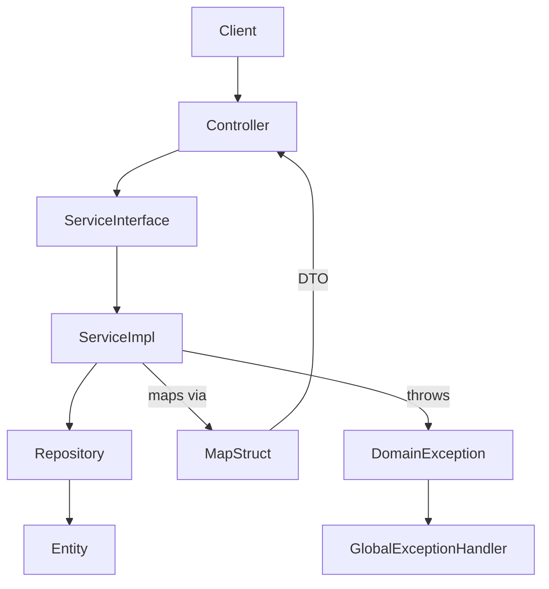

# Explain Architecture — Employee Service

Analyse the project structure and explain the architecture of: **${input:scope}**

(e.g. `the whole project`, `the service layer`, `the EmployeeController`, `the exception handling`)

## What to Cover

### 1. Module Structure
- What modules exist (`employee-service`, `employee-launcher`) and why
- How Maven multi-module is organised (parent `pom.xml`, child modules)
- What belongs in each module (business logic vs. application bootstrap)

### 2. Layer Map
Draw the layered architecture as a diagram showing:
- Controller → Service Interface → Service Impl → Repository → Entity
- Where DTOs flow (`EmployeeRequest` in, `EmployeeResponse` out)
- Where MapStruct fits (DTO ↔ Entity conversion)
- Where exceptions bubble up to the global handler

Use a Mermaid diagram:

### 3. Key Design Decisions
For each major decision, explain:
- **What** the pattern is
- **Why** it was chosen
- **Trade-offs** accepted

Focus on:
- Interface + Impl separation for services
- MapStruct over manual mapping
- DTOs over entity exposure
- Domain exceptions (`EmployeeNotFoundException`, `DuplicateEmailException`)
- Flyway for schema migration

### 4. Data Flow — End-to-End Example
Trace a `POST /api/employees` request through every layer:
1. HTTP request arrives at `EmployeeController`
2. Validation fires (`@Valid`)
3. Controller delegates to `EmployeeService.create()`
4. Service maps DTO → Entity via `EmployeeMapper`
5. Repository persists the entity
6. Service maps Entity → DTO
7. Controller wraps in `ResponseEntity.created()`

### 5. What to Improve (Optional)
If you spot architectural issues, flag them with **[SUGGESTION]** labels.

Keep the explanation clear enough for a new team member joining the project on day one.
